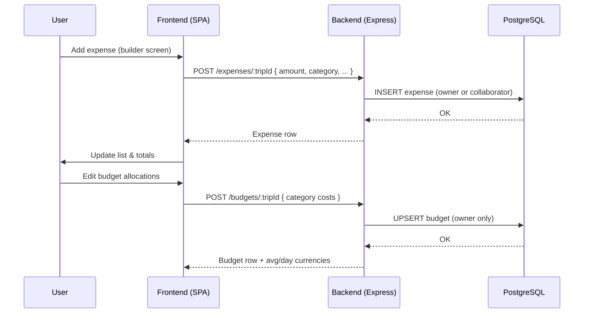

# GlobeTrotter MVP – Hackathon-Ready Travel Planner

GlobeTrotter is a polished, production-lean MVP to plan smarter trips fast. It pairs a modern React frontend with a secure Express + PostgreSQL backend and uses free-tier APIs (HuggingFace, OSM, OpenWeather, exchangerate.host). It’s tailored for demos and hackathons: fast to set up, reliable fallbacks, nice UI, and real persistence.

## Highlights

- Professional UI: React + TypeScript, Tailwind, ShadCN UI, icons, responsive layouts.
- Smart Suggestions: AI-powered ideas and nearby places via HuggingFace + OSM (Overpass/Nominatim), with resilient fallbacks.
- Rich Itinerary Builder: Manual days per city, drag-and-drop ordering, inline activities with persistence.
- Live Map: Leaflet + OSM tiles, city geocoding, auto-fit route, distance summary.
- Collaboration & Sharing: Collaborators, public trip boards, notifications.
- Budget & Utilities: Budget tracker, expense splitter, packing list, currency conversion.
- Resilient Architecture: Backend proxy for free APIs, JWT auth, typed client, health checks, .env templates.

## Quick start

- Prereqs: Node 18+, PostgreSQL 14+.
- Environment: copy the provided examples and fill values.

```powershell
# Backend
Copy-Item globetrotter-backend/.env.example globetrotter-backend/.env
# Frontend
Copy-Item frontend/.env.example frontend/.env
```

Edit `globetrotter-backend/.env` and add API keys:

- OPENWEATHER_API_KEY, HUGGINGFACE_API_KEY (OSM Overpass/Nominatim require no keys)

Then install and run:

```powershell
# Backend
cd globetrotter-backend
npm install
npm run dev

# In a new terminal – Frontend
cd ../frontend
npm install
npm run dev
```

Health check: <http://localhost:5000/health> (db=true and env flags=true when keys are present)

Frontend URL: <http://localhost:5173> (or the next available port if 5173 is in use).

Tip (Windows/PowerShell): use separate terminals for backend and frontend.

## Admin bootstrap, seed data, and analytics

Use the built-in admin to quickly populate demo data and view live metrics:

1) Bootstrap default admin (creates admin user if missing)

```powershell
Invoke-RestMethod -Method POST http://localhost:5000/admin/bootstrap | ConvertTo-Json
```

1) Login as admin to get a JWT

```powershell
$body = @{ email = "admin@example.com"; password = "admin123" } | ConvertTo-Json
Invoke-RestMethod -Method POST -ContentType 'application/json' -Body $body http://localhost:5000/admin/login | ConvertTo-Json
```

1) Seed demo data (users, a trip with stops/activities, expenses)

```powershell
# Replace TOKEN with the token returned from the login step
Invoke-RestMethod -Headers @{ Authorization = "Bearer TOKEN" } -Method POST http://localhost:5000/admin/seed | ConvertTo-Json
```

1) View admin analytics (counts and totals)

```powershell
Invoke-RestMethod -Headers @{ Authorization = "Bearer TOKEN" } http://localhost:5000/admin/analytics | ConvertTo-Json
```

Or use the in-app Admin Dashboard (route: `/admin`) to sign in, seed, and view metrics.

## Repository layout

- frontend/ – React app (Vite, TS, Tailwind). Entry: `src/main.tsx`. Screens in `src/components`.
- globetrotter-backend/ – Express API with routes for auth, trips, stops, activities, budgets, etc.
- prisma/ – DB schema and migrations (backend).
- docs/ – Architecture and sequence diagrams (Mermaid).

## Core use cases

- Onboard: Signup, login, land on dashboard with “Welcome back” and Smart Suggestions.
- Create Trip: Name, dates, cover photo; set public/private for sharing.
- Build Itinerary:
  - Add cities with manual days; re-order with drag-and-drop; dates auto-flow by order.
  - See live map of the route with bounds-fit and distance.
  - Add activities inline per city (name, time, duration, cost, notes) with backend persistence.
- Smart Suggestions:
  - Ideas via HuggingFace and nearby places via OSM Overpass; if live data is missing, the app falls back to popular destinations.
  - Weather snapshot per city via OpenWeather.
- Collaborate: Invite users with roles; see notifications; share public itinerary page.
- Budget & Utilities: Track trip budgets, split expenses, auto-calc activities cost, packing list, currency conversion.

Notes on Smart Suggestions UX

- The “AI Creative Suggestion” banner was removed for a cleaner interface.
- Suggestion cards are non-clickable; use explicit buttons: Explore and Add to Trip.
- When adding to trip, a lightweight dialog lets you customize fields (name, type, cost, description, image) before saving.

## Architecture

See full-size diagrams in `docs/architecture.md`.

### System/Container view


### Smart Suggestions sequence


### Activities persistence sequence


### Expenses and budget flow



## Backend surface (selected endpoints)

- Auth: POST /auth/login, POST /auth/register
- Trips: GET/POST/PUT /trips, GET /trips/:id
- Stops: GET /stops/:tripId, POST /stops/:tripId, DELETE /stops/:stopId, PATCH /stops/reorder
- Activities: GET /activities/stop/:stopId, POST /activities/:stopId, PUT/DELETE /activities/:activityId
- Budgets/Expenses: /budgets/:tripId (owner edit; collaborators can view), /expenses/:tripId (owner or collaborators add/list), /expenses/:expenseId (delete own)
- Proxies: /ai/suggest, /geo/..., /places/..., /weather, /currency

All protected endpoints require `Authorization: Bearer <JWT>`.

## Environment & config

- Frontend: `frontend/.env`
  - VITE_API_URL=<http://localhost:5000>
- Backend: `globetrotter-backend/.env`
  - DATABASE_URL or DB_* fields
  - JWT_SECRET
  - OPENWEATHER_API_KEY, HUGGINGFACE_API_KEY
  - Optional HUGGINGFACE_MODEL

Database

- Prisma schema and migrations live under `globetrotter-backend/prisma`.
- Ensure DATABASE_URL uses a database with permissions to create tables.

## Testing and quality

- Lint/Typecheck: TypeScript + Vite build for frontend; Node for backend.
- Health check: `/health` confirms DB connectivity and API key presence.
- Error handling: Proxy routes use fallbacks to keep UX responsive in demos.

Backend tests

```powershell
cd globetrotter-backend
npm test
```

Frontend production build

```powershell
cd frontend
npm run build
```

## Demo tips

- Seed a sample trip, add 2–3 cities, then show:
  - Add city with manual days; drag to reorder and watch dates flow.
  - Activities add/remove updating cost totals.
  - Map auto-fitting the route.
  - Dashboard Smart Suggestions combining AI text + nearby places + weather.
  - Collaborator invite and public share toggle.
  - Calendar view: click a day to see trips, update start/end inline, and persist.
  - Budget view: see Planned vs Recorded vs Remaining, edit category budgets, and watch expenses affect totals.

PWA/service worker

- The service worker is set to activate immediately on updates to avoid stale UI (e.g., removed banners).
- If you ever see outdated UI, hard refresh or clear site data to force a fresh cache.

Troubleshooting

- Port 5173 in use: Vite will auto-pick a new port (check terminal output).
- Health check shows db=false: verify DATABASE_URL and that PostgreSQL is reachable.
- 401/Forbidden on budgets: only the trip owner can edit budgets; collaborators can view.
- Expenses not visible to collaborators: ensure they’re added via Collaborators; then expenses list includes all trip entries.

## License

MIT (for hackathon use). External APIs subject to their own terms.
