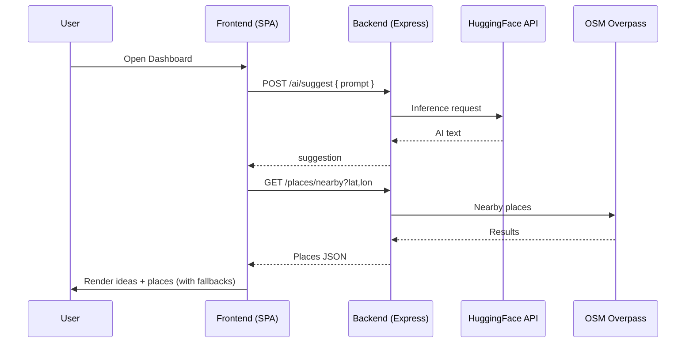
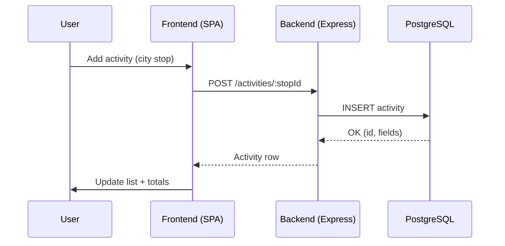

# GlobeTrotter – Architecture Overview

## Container View

```mermaid
C4Container
Title GlobeTrotter – Containers

Person(user, "Traveler")

System_Boundary(app, "GlobeTrotter") {
  Container(frontend, "Web App (SPA)", "React + Vite + TS + Tailwind", "Dashboard, Builder, Map, Suggestions")
  Container(api, "Backend API", "Node.js + Express", "Auth, Trips, Stops, Activities, Budgets, AI/Places/Weather proxies")
  ContainerDb(db, "PostgreSQL", "RDBMS", "Users, Trips, Stops, Activities, Budgets, Collaborators")
}

System_Ext(osm_overpass, "OSM Overpass", "Places search & details")
System_Ext(osm_nominatim, "OSM Nominatim", "Geocoding")
System_Ext(ow, "OpenWeather", "Weather snapshot")
System_Ext(hf, "HuggingFace Inference API", "AI suggestions")
System_Ext(exr, "exchangerate.host", "Currency conversion")

Rel(user, frontend, "Uses", "HTTPS")
Rel(frontend, api, "JSON/HTTPS")
Rel_Back(api, db, "SQL")
Rel(api, osm_overpass, "HTTPS")
Rel(api, osm_nominatim, "HTTPS")
Rel(api, ow, "HTTPS")
Rel(api, hf, "HTTPS")
Rel(api, exr, "HTTPS")
```

## Smart Suggestions Sequence



## Activities Persistence Sequence


